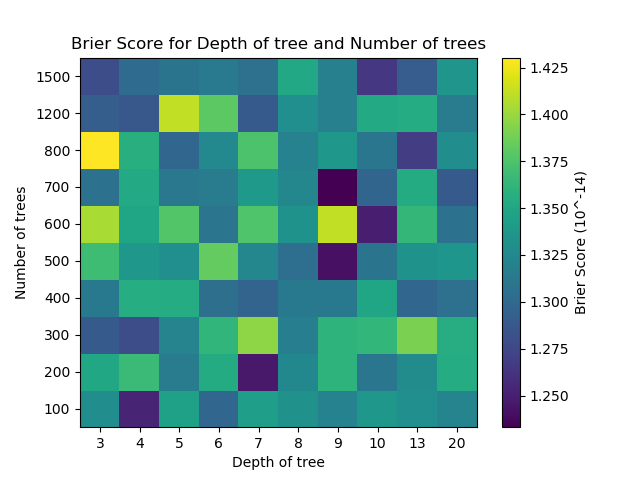
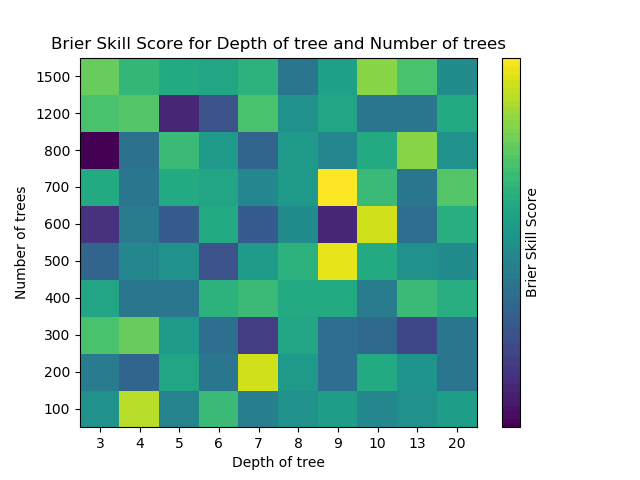

# Storm Predictor
Use decision trees for classification and regression. Used to predict probability of storm.

## Classification

Uses **_DecisionTreeClassifier_**, **_RandomForestClassifier_**, **_GradientBoostingClassifier_** of the [scikit library](http://scikit-learn.org/stable/)

## Regression

Uses **_DecisionTreeRegressor_**, **_RandomForestRegressor_**, **_GradientBoostingRegressor_** of the [scikit library](http://scikit-learn.org/stable/)

## Screenshots

